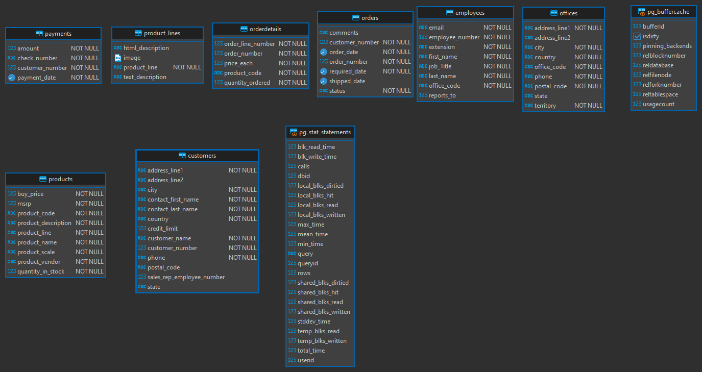
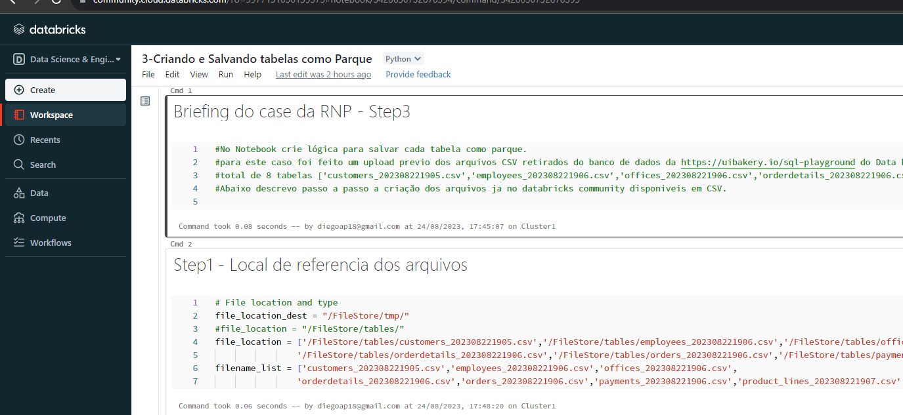
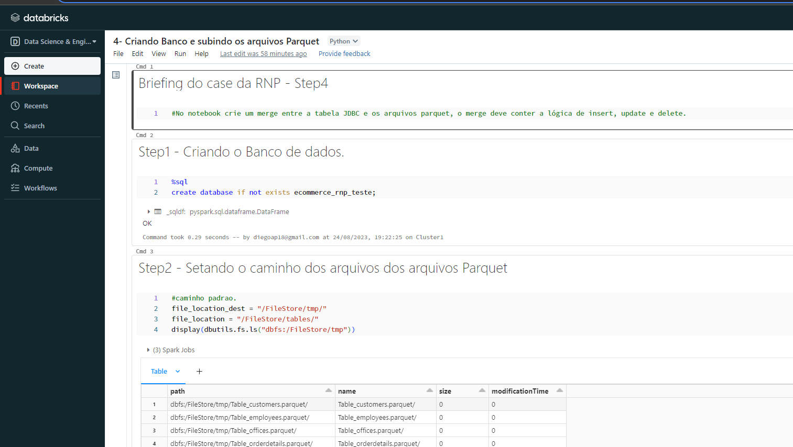
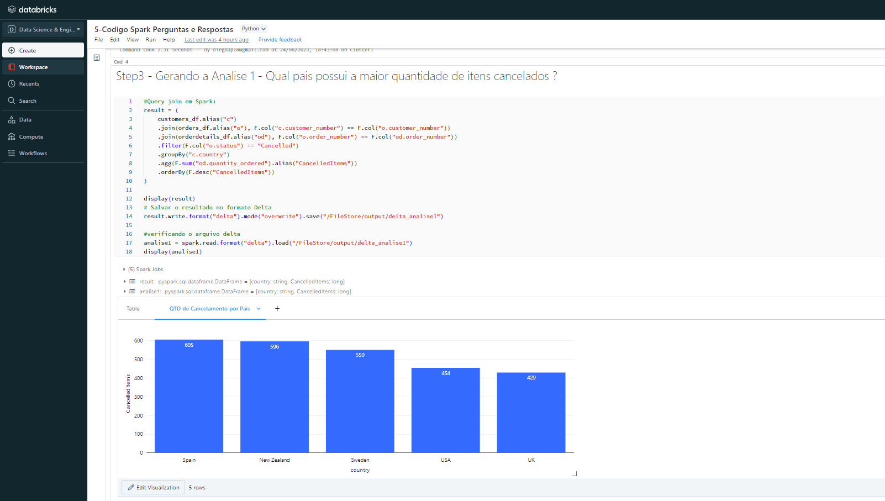

### DESAFIO RNP TESTE DE DADOS

1- Download dos arquivos de banco no site:  [Uibakery-sql-playground](https://uibakery.io/sql-playground)  
2- Usando DBeaver fiz a conexão com o site Uibakery e extrai os dados das tabelas.
> No software mencionado acima foi gerado arquivos CSV com os dados,  tambem foi gerado um arquivo SQL disponivel no diretorio chamado: ***ecommerce_tables.sql***
 
3- Usando a Ferramenta erwin foi gerado 2 arquivos: 
<blockquote>TB_DIAGRAM.erd e TB_DIAGRAM.png   São os Diagrams simples da base de dados.</blockquote>

Image do Diagrama das tabelas:   
 

4- Criação do notebook no [Databricks Community](https://community.cloud.databricks.com/)  
para este case utilizei a versão gratuita da ferramenta.   Nele foi criado um cluster e um notebook para criação da logica 
das tabelas mencionadas no modelo acima em parquet na plataforma. 

Nesta Etapa foi criado de acordo com o Briefing do arquivo enviado pela RNP, a conclusão esta no notebook abaixo:  
***Obs: o nome do notebook se refere as etapas descritas no arquivo "DESAFIO_RNP-TESTE.PDF"***
<blockquote>Caminho: \usr\notebooks\3-Criando e Salvando tabelas como Parque.ipynb</blockquote>
 

Image previa do arquivo direto da Plataforma DataBricks Community:   
 

Após concluir a etapa anterior, segui para a criação das tabelas, banco de dados, merge, insert, update, delete no ambiente Databricks  
 

5 - Nesta Etapa foi criado o banco de dados "ecommerce_rnp_teste", e as tabelas do arquivo "ecommerce_tables.sql" 
usei os arquivos Parquet para gerar as tabelas no DB "ecommerce_rnp_teste". A resolução se encontra no notebook abaixo: 

<blockquote>Caminho: \usr\notebooks\4- Criando Banco e subindo os arquivos Parquet.ipynb</blockquote>
 

Image previa do arquivo 2 direto da Plataforma DataBricks Community:   
 

6- Neste ponto inicio as analises conforme descrito abaixo:
<blockquote>
  - Qual país possui a maior quantidade de itens cancelados?  
  - Qual o faturamento da linha de produto mais vendido, considere como os itens Shipped, cujo o pedido foi realizado no ano de 2005?  
  - Nome, sobrenome e e-mail dos vendedores do Japão, o local-part do e-mail deve estar mascarado.
</blockquote>
 
Criei um notebook chamado:
<blockquote>Caminho: \usr\notebooks\5-Codigo Spark Perguntas e Respostas.ipynb</blockquote>
 

Nele inclui os resultados possiveis das analises solicitadas. 

Image previa do arquivo 3 direto da Plataforma DataBricks Community:   
 

Por fim todos os resultados foram salvos em formato delta que se encontra no caminho abaixo  
<blockquote>são 3 deltas: delta_analise1,delta_analise2,delta_analise3    
Caminho: \FileStore\output\delta_analise1 
Caminho: \FileStore\output\delta_analise2 
Caminho: \FileStore\output\delta_analise3 </blockquote>
 

## Conclusão:
O case demostrou, não somente a habilidade de utilizar o databricks, mas tambem a possibilidade de realizar analises variadas na plataforma
deste modo, pude relembrar um pouco da minha epoca de analista de dados e claro pude novamente usar as ferramentas da databrics. 

Por fim agradeço pelo desafio e vou deixar este case ativo aqui como portfolio, para futuras consultas e oportunidades.

